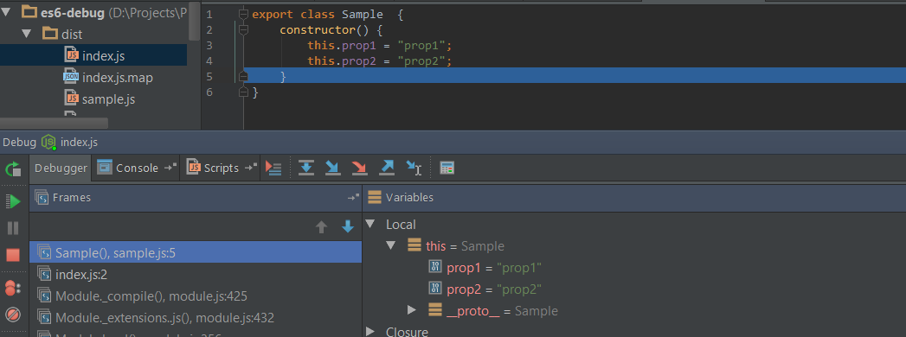

# Debugging ES6 in Webstorm

> Just a short reminder for myself how to get debugging to work in Webstorm with ES6.
> If it helps also you, then great! ;-)

**Folder structure** being used:

```text
root
|-- src
   |-- index.js
   |-- sample.js
.babelrc
gulpfile.babel.js
package.json

```

The setup described below uses gulp 3.x to transpile ES6 files to ES5, including source-maps, which can then be used in Webstorm to debug ES6.

**Note:** 
As soon as gulp 4.0 is out, some changes are necessary, gulp 4.0 introduces some breaking changes.

## Prerequisites
Install the required modules as devDependencies:

- babel-core
- babel-preset-es2015
- gulp
- gulp-babel
- gulp-sourcemaps


```bash
$ npm install babel-core babel-preset-es2015 gulp gulp-babel gulp-sourcemaps
```
**Note:** `babel-core` and `gulp` can and probably should be installed globally.

## Setup gulp to work with ES6

- Instead of naming your gulp file `gulpfile.js` rename it to `gulpfile.babel.js`
- Use the following gulp-script:

```js
import gulp from "gulp";
import sourceMaps from "gulp-sourcemaps";
import babel from "gulp-babel";
import path from "path";

const paths = {
	es6: ['./src/**/*.js'],
	es5: './dist',
	// Must be absolute or relative to source map
	sourceRoot: path.join(__dirname, 'src')
};
gulp.task('babel', () => {
	return gulp.src(paths.es6)
			.pipe(sourceMaps.init())
			.pipe(babel({
				presets: ['es2015']
			}))
			.pipe(sourceMaps.write('.', { sourceRoot: paths.sourceRoot }))
			.pipe(gulp.dest(paths.es5));
});
gulp.task('watch', () => {
	gulp.watch(paths.es6, ['babel']);
});

gulp.task('default', ['watch']);
```

Running `gulp` will now create a folder dist with the transpiled scripts + sourcemaps in it.

Inspirations for this script:
- [2ality - Using transpiled ES6 on Node.js](http://www.2ality.com/2015/04/node-es6-transpiled.html)
- [Using ES6 with gulp](https://markgoodyear.com/2015/06/using-es6-with-gulp/)


## Setup your project
Just as a simple example let's add the following files into `./src`:

**sample.js**

```js
export class Sample  {
	constructor() {
		this.prop1 = "prop1";
		this.prop2 = "prop2";
	}
}
````

**index.js**
```js
import {Sample} from './sample';
let sample = new Sample();
console.log( sample.prop1 );
console.log( sample.prop2 );
```

Now run

	gulp

Whenever you make changes, four file will be generated in the `./dist` folder:


## Debug in Webstorm
So, now let's have a look how to debug in Webstorm (version 11 is used here):

Set a breakpoint:
- Go to the ./dist folder and create the desired breakpoint:


Start the debugger in Webstorm, by right-clicking on `dist/index.js` (not `src/index.js` !!!).

You will then get:


So, not really nice, probably a Webstorm bug.
But if you hit F8 (Step Over ) you will then get



We are done, happy debugging in Webstorm!